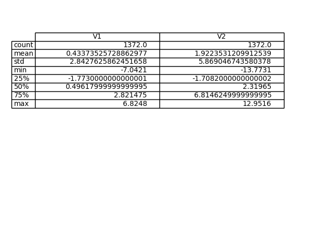
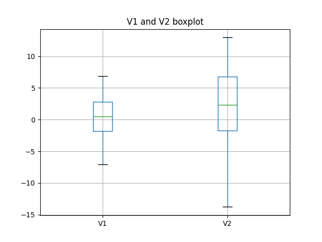
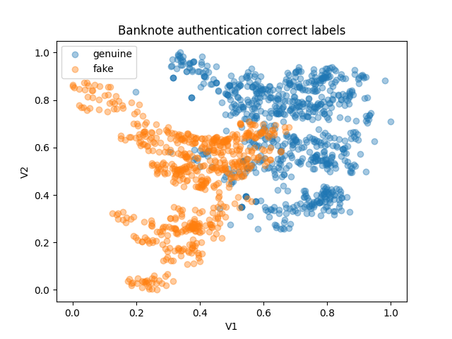
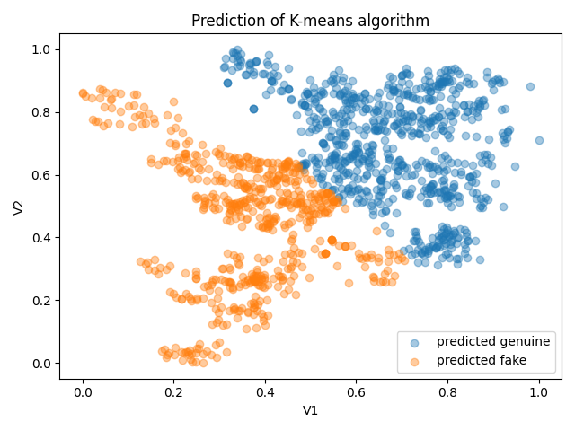
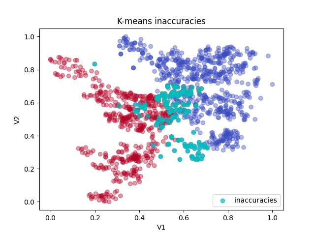
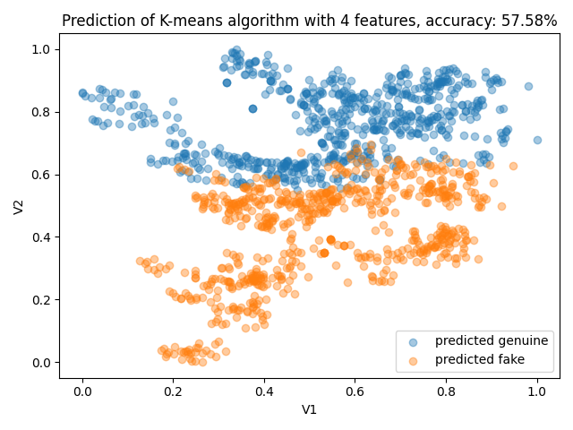
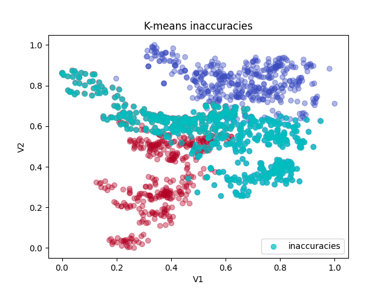
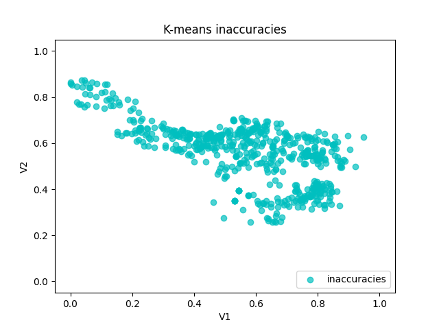

# Project Report on The Analysis of Kmeans Clustering on Banknote Authentication

## Project Summary
The [openML banknote authentications](https://www.openml.org/search?type=data&sort=runs&id=1462&status=active) is a dataset about distinguishing genuine and forged banknotes.

Data were extracted from images that were taken from genuine and forged banknote-like specimens. A Wavelet Transform tool was used to extract features from these images.

The project used a simplified version of the dataset with only two features; V1 (the variance of Wavelet Transformed image) and V2 (skewness of Wavelet Transformed image).

## Evaluating the dataset suitability for Kmeans clustering
### The dataset summary

### 0utliers:

K-Means clustering is sensitive to outliers. Outliers can distort the clustering process, causing the algorithm to create less reliable clusters.

The above is a boxplot; used to graphically depict the groups of numerical data through their quartiles.
- The box extends from the Q1 to Q4 quartile values of the data.
- The whiskers extend from the edge of the box to show the range of the data; by default, extending no more than 1.5*(Q3-Q1) from the edges of the box.
- Any outliers in the dataset are plotted as separate dots.

The boxplot shows that there are no outliers in the dataset.

### Size:
A study by [Dolnicar et al. in 2013](https://journals.sagepub.com/doi/full/10.1177/0047287513496475) recommended that the sample size be at least 70 times the number of variables for cluster analysis.

The given dataset has 2 features and 1372 observations, thus it is a suitable size for K-Means clustering.

### Data-Type:
The values in the dataset for both features are stored as float.

The type of data best suited for K-Means clustering are numerical data as it would be measuring the Euclidean distance between data points

### Features:
K-Mneans works best with relatively lower number of dimension or it will suffer from the curse of dimensionality.

Increasing the dimensions increases the complexity of the data without necessarily increasing the amount of useful informaion

Although the original dataset contains four features; for this project, only two features will be used, making it more suitable to apply K-means clustering

## Report

The dataset contains another feature called `Class`, labelling the banknotes as either genuine or fake. 

The above image is a scatter plot with the feature `V2` and `V1` on the x and y axis respectively, labelled based on `Class` feature.

### K-means clustering

