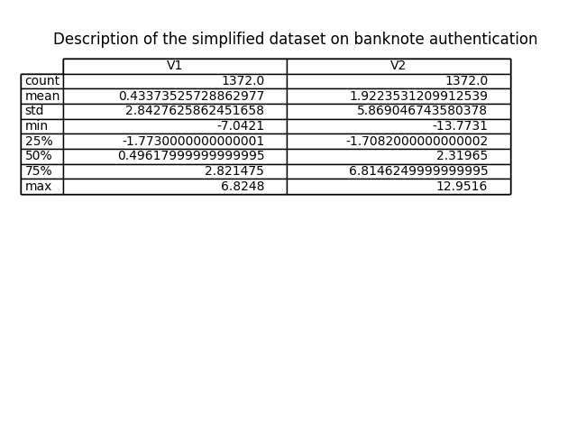

# Project Report on The Analysis of Kmeans Clustering on Banknote Authentication

## Project Summary
The [openML banknote authentications](https://www.openml.org/search?type=data&sort=runs&id=1462&status=active) is a dataset about distinguishing genuine and forged banknotes.

Data were extracted from images that were taken from genuine and forged banknote-like specimens. A Wavelet Transform tool was used to extract features from these images.

The project used a simplified version of the dataset with only two features; V1 (the variance of Wavelet Transformed image) and V2 (skewness of Wavelet Transformed image).

## Evaluating the dataset suitability for Kmeans clustering
### outliers

## Analysis
## Report
